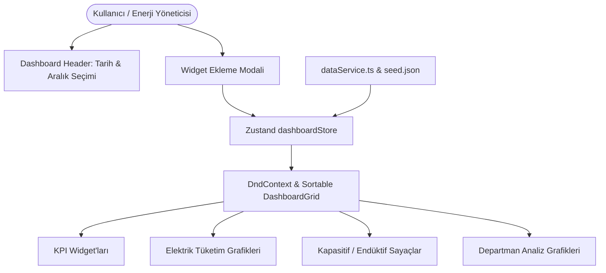

# 📊 Dynamic Energy Dashboard - Drag & Drop Analytics & Monitoring Platform

[](https://www.typescriptlang.org/)
[](https://reactjs.org/)
[](https://vitejs.dev/)
[](https://tailwindcss.com/)
[](https://dndkit.com/)
[](https://www.yucelgumus.dev/)

> Enerji tüketim ve üretim verilerini gerçek zamanlı izleyen, kullanıcıların bileşenleri sürükleyip bırakarak (**Drag & Drop**) kendi izleme panellerini oluşturmasına olanak tanıyan, modern **React 19, Vite 7 ve @dnd-kit** tabanlı dinamik gösterge paneli (dashboard).

---

## 🌟 Öne Çıkan Özellikler

- 🧱 **Sürükle & Bırak Grid Düzeni (@dnd-kit):** Kullanıcıların widget kartlarını serbestçe taşımasına, sıralamasını değiştirmesine ve paneli kişiselleştirmesine imkan tanır (`DashboardGrid.tsx`).
- ⚡ **Zengin Enerji Widget Yelpazesi:**
  - `KpiCard`: Anlık tüketim, reaktif güç ve maliyet KPI kartları.
  - `ElectricityChart`: Zaman serisi bazlı elektrik tüketim eğrileri.
  - `CapacitiveGauge`: Kapasitif/Endüktif ceza oranlarını gösteren radyal göstergeler.
  - `DepartmentChart`: Departmanlar arası enerji dağılım pasta/çubuk grafikleri.
- 🎛️ **Bileşen Seçici & Önizleme Modalı:** Kullanıcıların yeni grafik ve KPI'ları panele eklemeden önce canlı önizleme yapabilmesi (`ComponentSelector.tsx`).
- 📅 **Zaman Aralığı & Çözünürlük Seçici:** Günlük, haftalık, aylık zaman filtreleri ve anlık veri periyodu seçimi (`DateRangePicker.tsx`, `IntervalSelector.tsx`).
- 💾 **Zustand Tabanlı Durum Saklama:** Kullanıcının oluşturduğu grid düzenini ve filtre tercihlerini tarayıcıda kalıcı olarak saklama (`dashboardStore.ts`).

---

## 🏗️ Mimari & Modül Şeması



---

## 🚀 Hızlı Başlangıç

### Gereksinimler
- **Node.js**: v18.0 veya üstü

### Kurulum

```bash
git clone https://github.com/yucel-gumus/dynamic_dashboard.git
cd dynamic_dashboard

npm install
```

### Başlatma

```bash
npm run dev
```

Uygulama `http://localhost:5173` adresinde çalışacaktır.

---

## 📂 Proje Dizin Yapısı

```
dynamic_dashboard/
├── package.json
├── tailwind.config.js
├── vite.config.ts
└── src/
    ├── main.tsx
    ├── App.tsx
    ├── store/
    │   └── dashboardStore.ts       # Grid yerleşimi ve widget durumları
    ├── services/
    │   └── dataService.ts          # Enerji veri servis katmanı
    ├── data/
    │   └── seed.json               # Örnek enerji telemetri verisi
    ├── components/
    │   ├── DashboardGrid.tsx       # Sürükle-bırak ana grid konteyneri
    │   ├── dashboard/              # Başlık ve bileşen seçici
    │   ├── widgets/                # Enerji grafikleri, sayaçlar ve KPI kartları
    │   └── ui/                     # Tooltip, modal ve tarih seçici
    └── types/
        └── index.ts                # Widget ve veri tipleri
```

---

## 📄 Lisans
Bu proje [MIT Lisansı](LICENSE) ile lisanslanmıştır.

---

## 👨‍💻 Geliştirici & İletişim

**Yücel Gümüş** - Full Stack Developer

- 🌐 **Web Sitesi / Portfolyo:** [yucelgumus.dev](https://www.yucelgumus.dev/)
- 💼 **LinkedIn:** [linkedin.com/in/yucel-gumus](https://www.linkedin.com/in/yucel-gumus/)
- 🐙 **GitHub:** [@yucel-gumus](https://github.com/yucel-gumus)

<p align="left">
  <a href="https://www.yucelgumus.dev/" target="_blank" rel="noopener noreferrer">
    
  </a>
</p>